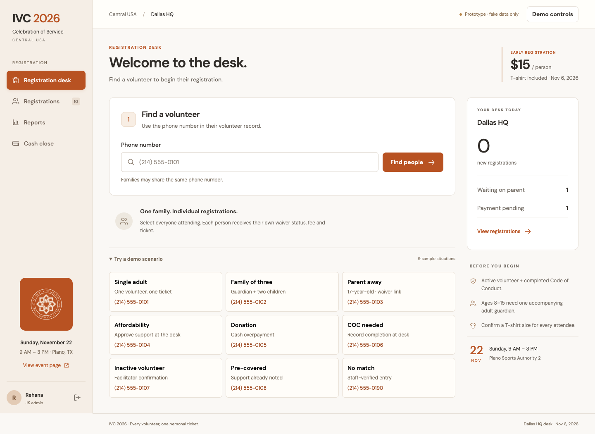
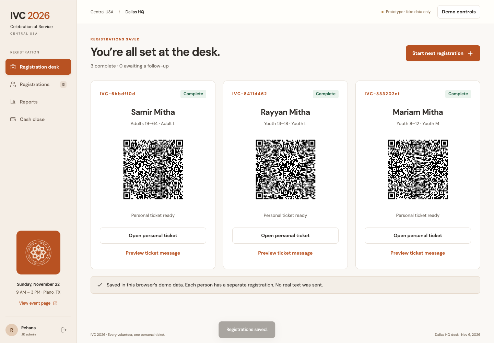
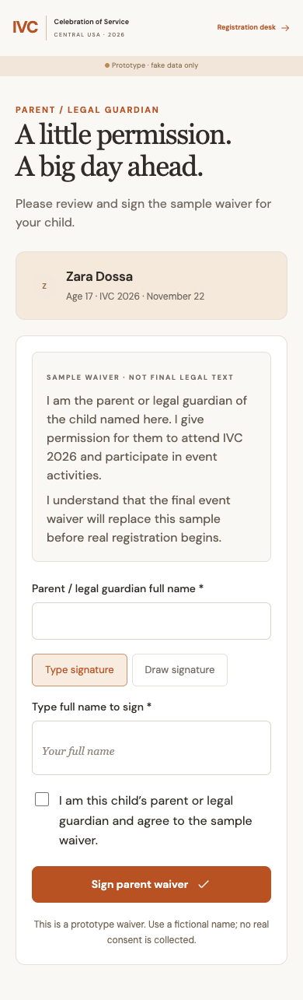
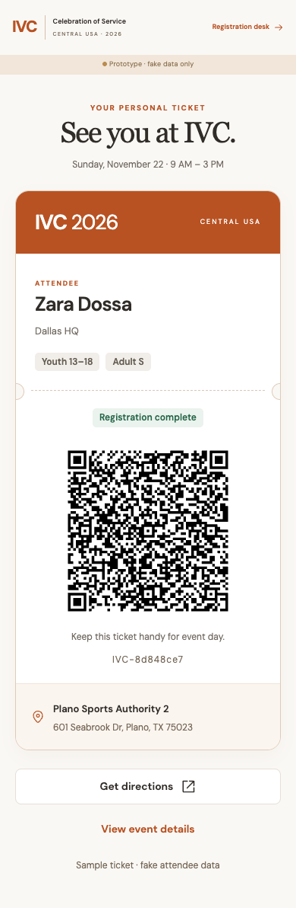

# IVC 2026 registration — ShipRight field example

**Status: Historical v1 prototype plus owner feedback and revised v2 brief, September 25, 2026.** This is a real project brief exercised through the complete ShipRight workflow. The people, phone numbers, accounts, payments and signatures in the prototype are fictional. It is not a deployed registration service for collecting real attendee data.

**Original v1 builder:** Codex, using the user's current session/model. No model switch, paid model API, separate agent or competitor research was used.

**ShipRight version:** `0.3.0-draft`, commit `fd33e90d4311b7446afbdad2d26de937c5245f5c`. The original build used the pack's core skills without modification. The subsequent owner review now informs the 0.4.0-draft skill update. The result and review were authored by the same agent, so this is not independent validation of ShipRight.

## Current requirements and learning

Read [Context brief v2](docs/06-context-brief-v2.md) and [the feedback-to-skill learning record](feedback/shipright-learning.md) first. The owner identified missing alternate lookup, family setup, advance prerequisite warnings and direct return flows, and clarified that everyone needs a waiver and excess cash is change unless explicitly donated. These changes are specified but **not implemented in this v1 demo**. A donation-only flow is also newly requested. The old tests do not verify this revised scope.

[Training candidates and limits](feedback/training-notes.md) are available for future dataset preparation; no fine-tuning has been run.

## The original product job

Desk volunteers register eligible attendees and families in person. A complete registration needs eligibility, one guardian for ages 8–15, a parent waiver for under 18, and a Paid or Covered payment status. Each person has an individual fee, shirt size and QR. JK admins reconcile their desk's cash; super admins see the region.

The supplied brand uses burnt orange and cream. The polished interface follows those requirements; the case study does not claim that a particular style improves conversion.

## Follow the process

| Stage | Actual artifact | What it establishes |
|---|---|---|
| Context and intake | [Product frame and decision log](docs/01-product-frame.md) | Current instructions outrank older meeting suggestions; no extra scope invented |
| Product design | [Flows, states and access](docs/02-flows-and-access.md) | Object lifecycles, screen jobs, happy/failure paths and five-path verification plan |
| UI/UX design | [Design and build handoff](docs/03-design-and-handoff.md) | Brand tokens, layout, accessibility requirements, one prompt per screen |
| Specification critique | [8/10/10 gate review](docs/04-specification-review.md) | Specification readiness only, before implementation |
| Build | [Runnable static source](prototype/index.html) | Actual linked interfaces and local data model |
| Implementation critique | [Final review and scenario matrix](docs/05-implementation-review.md) | Tested behavior, screenshot findings, two bounded fix passes and stated limits |
| Evidence | [Browser results](evidence/browser-final.json), [model tests](evidence/model-tests.txt), [source hashes](evidence/source-manifest.json) | Exact result evidence, not a planned checklist |

## What was exercised in v1

Against the original specification, all five grouped browser paths passed in Chrome at 1440×1000 and 390×844. Nine domain checks passed. The complete adult registration was also exercised with keyboard only; see [keyboard evidence](evidence/keyboard.json). Cases include single adult, guardian with two children, parent-away signing, requested/pre-marked coverage, overpayment, missing COC, inactive facilitator confirmation, no-match recovery, the price switch, a late pending payment, role scoping, reports, CSV and cash-close variance. A generated ticket QR was decoded to its exact personal URL.

Parent signing updates another desk tab in the **same browser** through browser storage. Separate devices do not synchronize. Google login, texts and Sheets are simulated. There is no real backend, allowlist security or legal waiver. The public ticket omits coverage and payment-category data.

## See the result

[Open the live clickable demo](https://ivc-2026-registration-demo.altazlavji.chatgpt.site) · [Public event page](https://ivc-2026-registration-demo.altazlavji.chatgpt.site/#event)





| Parent waiver | Personal ticket |
|---|---|
|  |  |

More: [public mobile page](evidence/final-event-mobile.png), [reports](evidence/final-reports.png), [cash close](evidence/final-cash-close.png).

## Run the example

From this directory:

```bash
python3 -m http.server 4173 --directory prototype
node --test tests/model.test.mjs
```

Open `http://localhost:4173`, choose the JK admin demo account, and try the scenario shortcuts. Demo controls switches role, JK and date and resets the data. No package installation is needed to run the prototype. Browser evidence scripts use Playwright and an installed Chrome; make Playwright available in your environment before rerunning.

## What this shows about ShipRight

- Source precedence kept obsolete attendee self-lookup and master-sheet writeback out of the product.
- Explicit state modeling kept incomplete parent/payment records from receiving admission QRs.
- The cash-close screen job exposed the need to record receipt dates separately from registration dates.
- Stage-specific evidence prevented planned behavior or screenshots from being represented as runtime validation.
- The bounded review produced specific corrections rather than an open-ended redesign.

This single project does not establish productivity gains, user satisfaction, accessibility certification or production readiness. Full limitations and proposed pack feedback are in the implementation review. The original app source is unchanged; the pack now includes targeted guidance informed by the owner’s review. See the learning record for exact changes and the current brief for open decisions.

## Asset and data notes

The logo was supplied by the project owner and remains attributable to its respective owner; this example does not relicense the event brand. qrcode-generator 1.4.4 is MIT-licensed with its notice retained. Fonts use Google Fonts with system fallbacks. The map is an external Google Maps embed with a direct-link fallback. Private source meeting materials and real attendee/contact data are not included.
